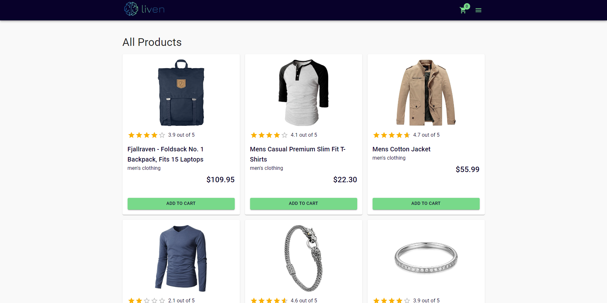
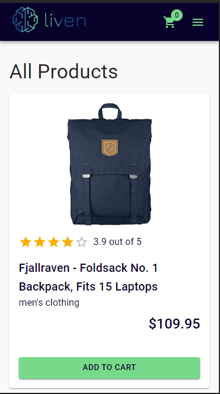
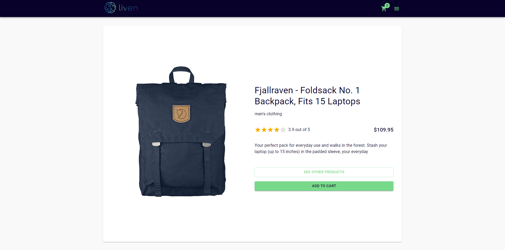
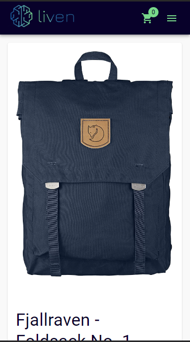
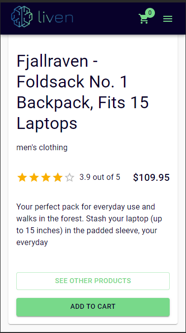
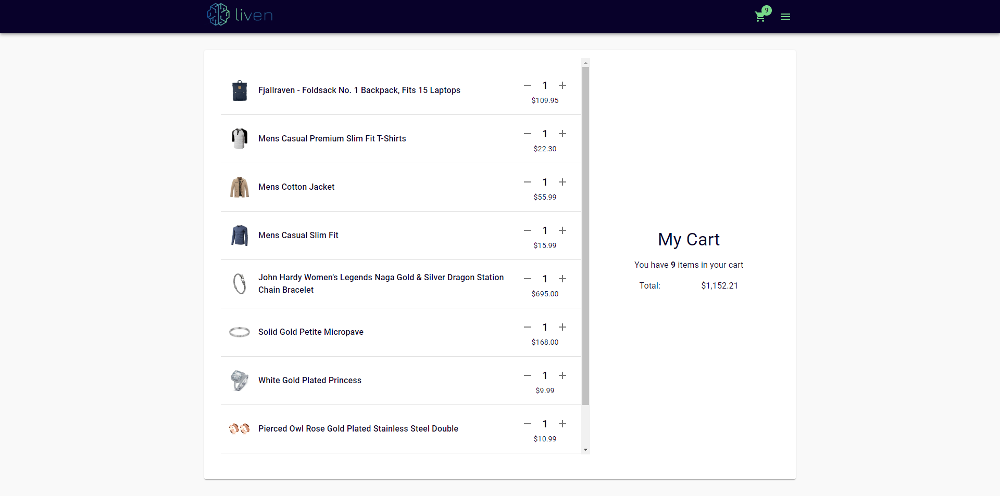
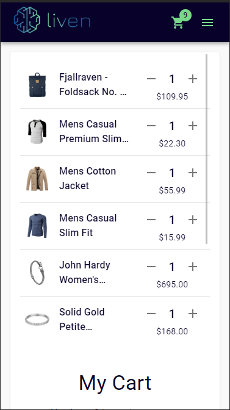
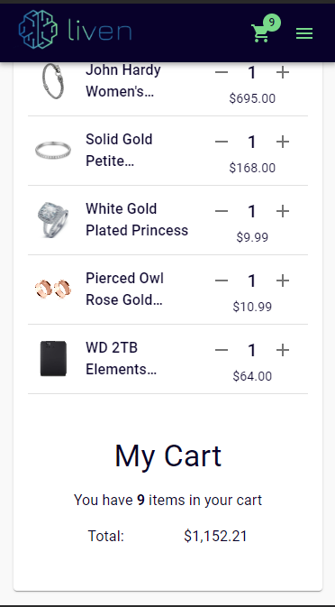

 

<h1 align="center">Teste para processo seletivo Liven</h1>

# ✅ Especificações

- [Liven - Projeto de avaliação técnica Frontend](https://liventech.notion.site/Liven-Projeto-de-avalia-o-t-cnica-Frontend-7e522e6babf640e6a313bedd8bdbadbb)

# ✅ Descrição do Projeto

Aplicação web responsiva de um ecommerce simples, com carrinho controlado pelo estado da aplicação.

# ✅ Features

- [x] Listagem De Produtos
- [x] Detalhes Do Produto
- [x] Carrinho

# 📱 Telas

<h2 align="center">Listagem De Produtos</h2>

A tela de produtos permite visualizar os produtos disponívies, bem como adicionar produtos ao carrinho e visualizar detalhes de algum produto específico.

 

 

<h2 align="center">Detalhes Do Produto</h2>

Na tela de detalhes do produto, é possível visualizar o produto com mais detalhes, contando com descrição e uma imagem maior.
É possível adicionar o produto ao carrinho ou voltar à pagina inicial.

 

 

 

<h2 align="center">Carrinho</h2>

No carrinho é possível adicionar ou remover produtos diretamente na tela, além de ter detalhes sobre os valores totais.

 

 

 

# ✅ Status do Projeto

<h3 align="center"> 
    🚀 Concluído 🚀
</h3>

# 🖥️ Dev

- Made with ❤️ by [Cirineu Rodrigues](https://www.linkedin.com/in/cirineurodrigues/)
